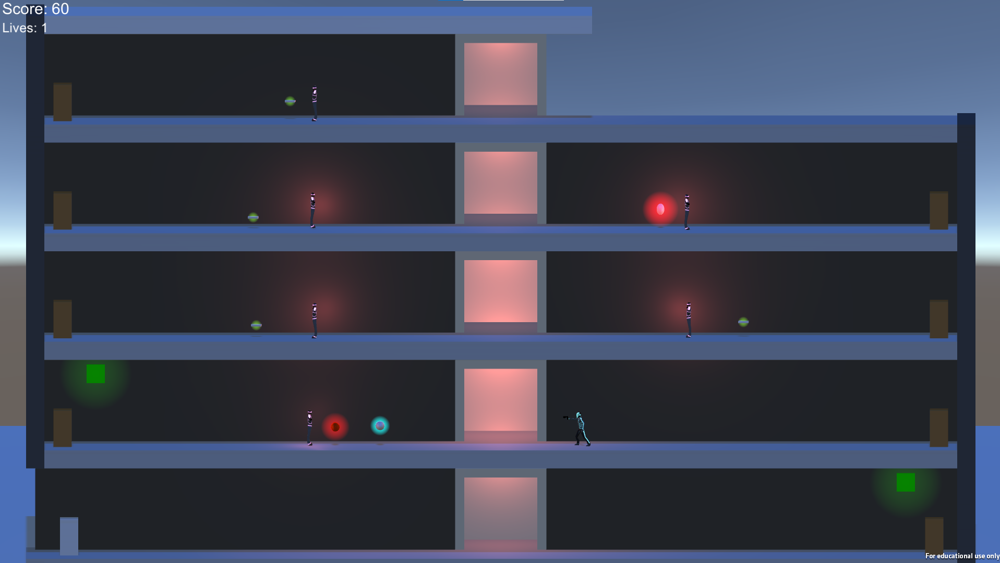

# Chase

### Game Summary:

Chase down the city's most wanted criminal, Ravi. During the great chase, Ravi's goons will try their best to stop you. You better be quick before Ravi escapes swiftly.

### Goal:

Your goal is to chase down the cities most wanted criminal, Ravi. You will need to fight his goons using a mysterious technology that makes your pistol stronger and collecting any money left behind from the mob boss's attempted escape.

### Controls:

Keyboard Controls:
        
    A - Move Left
    D - Move Right
    W - Use Doors
    Space Bar - Jump
    Left Mouse - Shoot
    
Xbox remote Controls:

    Left Stick - Move Left or right
    X - Use Door
    A - Jump
    Right Trigger - Shoot

Credits:

Noah Easly - Enemy AI programmer and Level Designer

Jeremy Flowers - Collectible and Player movement programmer

Bryce Deshotel - UI and power-up programmer

Samantha Soloman - Enviroment Artist and Level Designer

Sam Turner - Player/Enemy Textures

Lorenzo Sawyer Jr. - Player/Enemy animations

 

This project was made for our first year minor production asessment.
